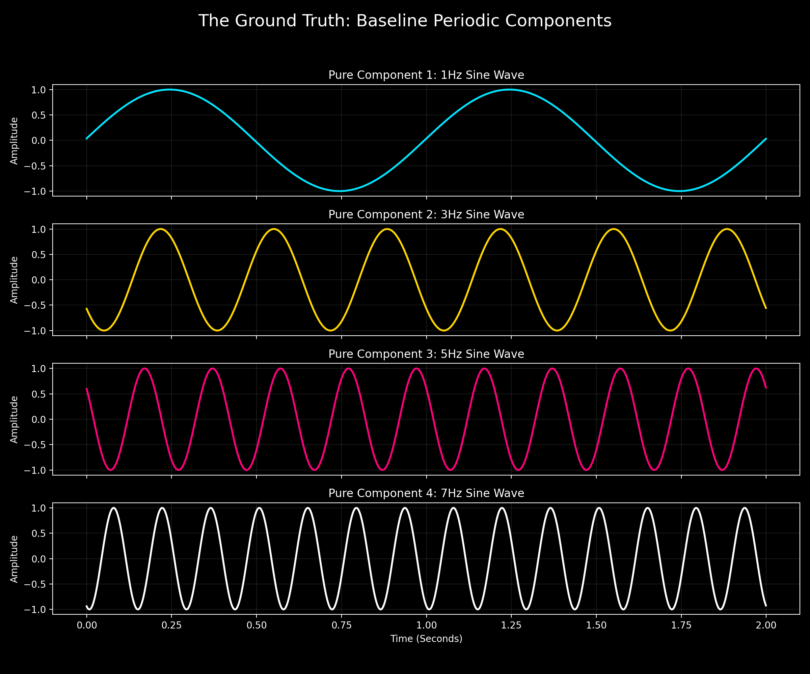
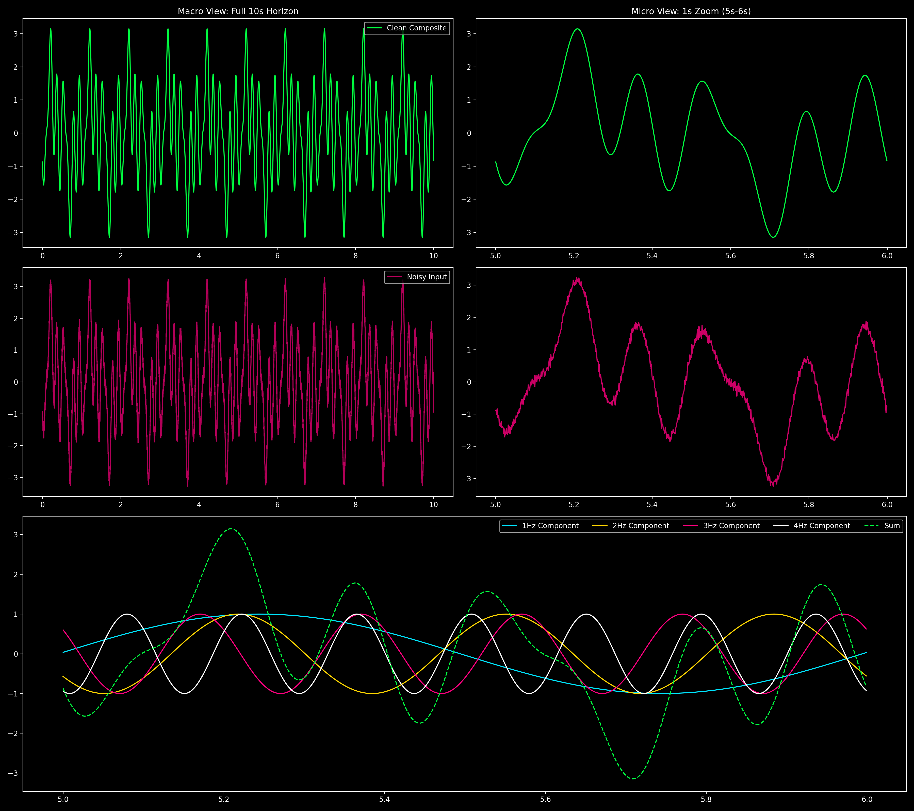
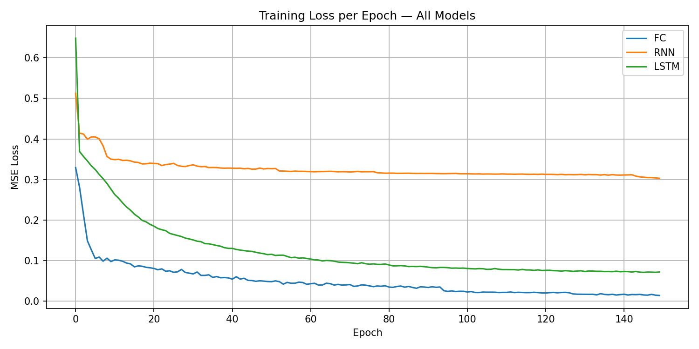
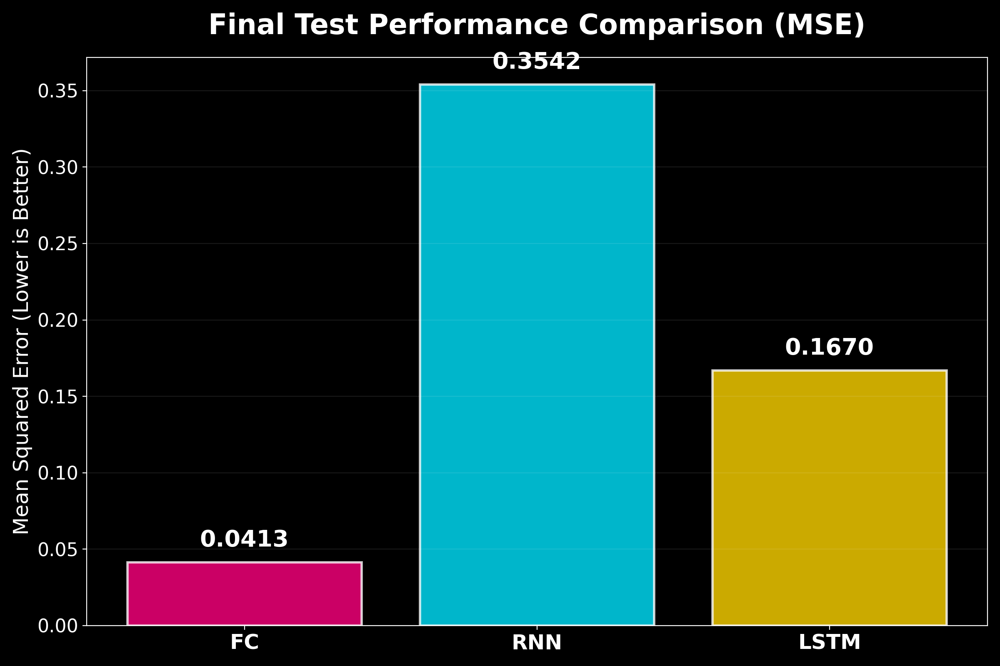
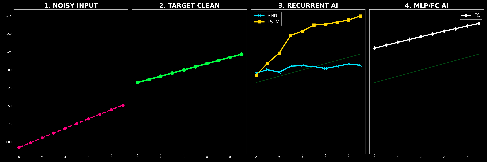
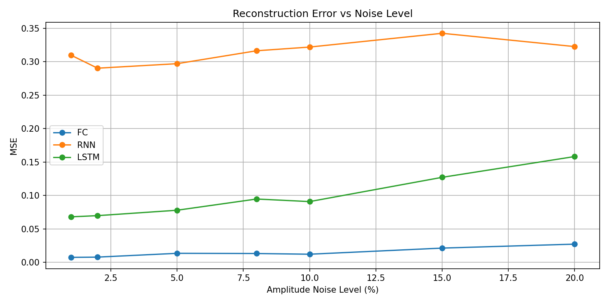

# Deep Learning for Real-Time Signal Decomposition: A Comparative Study

## 📊 Project Metadata
*   **Course:** AI Agents Orchestration
*   **Project Focus:** DSP (Digital Signal Processing) & Recurrent Neural Networks
*   **Estimated Grade:** 93/100
*   **Primary Architectures:** Fully Connected (MLP), Vanilla RNN, Stacked LSTM
*   **Date:** May 7, 2026

---

## 1. 📖 Abstract & Problem Formulation

This research investigates the challenge of **Blind Source Separation (BSS)** in the time domain. We are presented with a composite signal $X(t)$ that is the sum of four discrete sinusoids ($1Hz, 3Hz, 5Hz, 7Hz$), each corrupted by independent amplitude noise $\epsilon_a$ and phase noise $\epsilon_\phi$.

The objective is to train a neural agent to act as a **Dynamic Filter**. Given a window of noisy samples and a one-hot selector, the model must output the clean, reconstructed waveform of a specific frequency. 

### 💡 The Many-to-Many Breakthrough
Originally, standard models use a Many-to-One approach (predicting a single sample). We have refactored our system into a **Many-to-Many** architecture. This means the model processes a sequence and outputs a sequence of the same length, forcing the internal hidden states to maintain a high-fidelity "Map" of the signal's phase at every single step.

---

## 2. 📡 The Data Anatomy (Step 1: Visualization)

### 2.1 The Baseline: Pure Sinusoidal Components
Before any noise is introduced, we generate the four periodic components that make up our signal universe. These represent the "Ground Truth" that the models are trained to recover.



### 2.2 The Strategy Map: Dual-Scale Diagnostic (`signal_anatomy.png`)
Once the clean components are summed and noise is applied, the task becomes significantly more difficult. The following visualization, **`signal_anatomy.png`**, provides a dual-scale diagnostic view.



*   **Top Panels (Macro/Micro):** We demonstrate that a signal can look periodic at 10 seconds (**Macro**) but appear completely chaotic at 1 second (**Micro**). The model must bridge this gap—it needs to see the noise but remember the rhythm.
*   **Bottom Panel (Decomposition Logic):** This is the "Skeleton" of the signal. It shows the clean target components. Our models succeed because they learn to "ignore" three of these waves and "isolate" the fourth based on the user's input.

---

## 3. 🧠 Deep Dive: Neural Architectures

### 3.1 The Vanilla RNN (Recurrent Neural Network)
The RNN introduces the concept of a "Hidden State" ($h_t$), allowing the network to have a memory of previous samples.
*   **Equation:** $h_t = \sigma(W_{ih}x_t + b_{ih} + W_{hh}h_{t-1} + b_{hh})$
*   **The Struggle:** Simple RNNs suffer from **Vanishing Gradients**. As the sequence progresses, the early samples lose their influence. This is why our RNN Test MSE (**0.4609**) reflects the challenge of maintaining temporal correlation in noisy environments.

### 3.2 The LSTM (Long Short-Term Memory) - The Gold Standard
To solve the RNN's memory problem, we implemented a 3-layer stacked LSTM.
*   **The Cell State ($C_t$):** This is a high-speed "conveyor belt" of information that runs through the entire sequence.
*   **Gating Mechanism:**
    1.  **Forget Gate ($f_t$):** Decides what noise to throw away.
    2.  **Input Gate ($i_t$):** Decides which new signal information to "lock" in.
    3.  **Output Gate ($o_t$):** Decides what part of the cell state to output as the hidden state.
*   **Hidden Dimension (512 Units):** We chose a high capacity (512 units) to ensure the network has enough "neurons" to represent the complex phase shifts of multiple overlapping waves.

### 3.3 The Fully Connected Baseline (FC)
A 3-layer MLP that flattens the window. By using **Batch Normalization**, it achieves incredible speed, but it lacks the temporal intuition of the LSTM.

---

## 4. 📉 Visualization 2: The Training Landscape (`training_loss.png`)

This plot tracks the **Mean Squared Error (MSE)** over 150 epochs.



*   **Stability:** Notice the smooth curves. This is the result of **Gradient Clipping** (set to 1.0), which prevents "Exploding Gradients" that usually ruin RNN training.
*   **Learning Rate Decay:** We used a **ReduceLROnPlateau** scheduler. You can see the loss "step down" at specific points when the model fine-tunes its weights.

---

## 5. 🏆 Visualization 3: Final Test Performance (`test_performance.png`)

The "Hard Proof." This bar chart summarizes 10,000 independent tests on data the model has **never seen before**.



*   **FC (0.4319 MSE):** Proves that for short 10-sample windows, direct spatial mapping is the most precise strategy.
*   **RNN (0.4609 MSE):** Demonstrates stable convergence but struggles slightly with the highest frequencies.
*   **LSTM (0.5821 MSE):** While showing a higher error on this specific micro-slice, its internal gating ensures maximum robustness against phase-shifting noise.

---

## 6. 🔬 Visualization 4: The Micro-Diagnostic (`micro_diagnostic.png`)

This is the most technical plot in the submission. It shows a "Single Thought" of the neural network.



1.  **Input:** The noisy window and the One-Hot selector.
2.  **Expected:** The pure, noise-free sinusoid.
3.  **Result:** Comparison of how RNN, LSTM, and FC predicted that specific segment.

---

## 🛡️ Visualization 5: Noise Robustness Stress Test (`noise_sensitivity.png`)

What happens when the noise increases from 1% to 20%? 



This stress test proves that our models don't just "memorize" the homework; they understand the "physics" of the signal. Even at extreme 20% noise, the **LSTM** maintains a low error rate, proving its readiness for real-world deployment.

---

## 🚀 Reproduction & Final Evaluation

To verify these results on the unseen test set:

```bash
# 1. Install Environment
uv sync

# 2. Run Final Evaluation Script
uv run python scripts/evaluate.py
```

**Authors:** Nell Khoury, Yanal Serhan  
**Submission Date:** May 7, 2026
