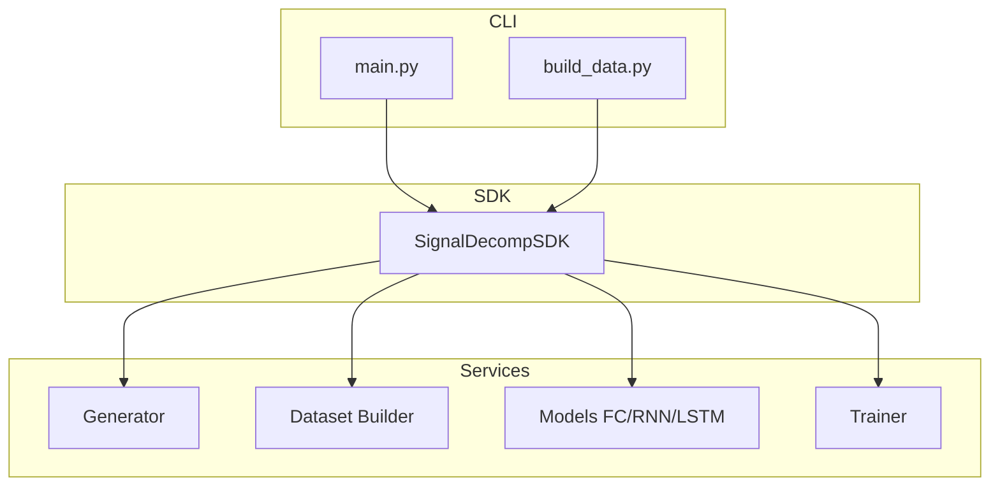

# PLAN — Architecture & System Design

## 1. Overview
The goal is to design a robust system for **Signal Decomposition** using three different neural architectures. The system must be scalable, maintainable, and adhere to professional software standards (SDK Pattern).

## 2. System Architecture (C4 Model)

### Context
*   **User/Researcher:** Interacts with the CLI to build data, train models, and run noise analysis.
*   **Signal Decomposition System:** The core logic that generates synthetic data and manages the neural training lifecycle.

### Container
*   **CLI Layer (`main.py`, `build_data.py`):** User entry points.
*   **SDK Layer (`src/signal_decomp/sdk/`):** The single gateway for all operations.
*   **Service Layer (`src/signal_decomp/services/`):** Specialized modules for data generation, dataset building, model definition, and training loops.

### Component

## 3. Design Patterns & Principles
*   **SDK Pattern:** Centralizes logic into `SignalDecompSDK` to decouple the UI/CLI from the business logic.
*   **Dependency Injection:** Configuration is passed into the SDK at initialization.
*   **Single Responsibility:** Each service handles one specific domain (e.g., `generator.py` only deals with signal math).
*   **Strategy Pattern:** The `Trainer` works with any model that inherits from `nn.Module`.

## 4. Implementation Strategy
1.  **Data Synchronization:** Ensure that the input window and target clean signal are generated from the exact same random seed/sample to maintain 100% correlation.
2.  **RNN Stability:** Use Orthogonal Initialization and Gradient Clipping (max_norm=1.0) to handle the inherent instability of deep recurrent networks.
3.  **Scaling:** Use `uv` for lightning-fast, reproducible dependency management and isolated virtual environments.

## 5. Noise Sensitivity Protocol
We evaluate model robustness by:
1.  Fixing the trained model weights.
2.  Generating fresh noisy test samples at varying amplitude percentages (1% to 20%).
3.  Calculating the MSE for each level to identify the crossover point where RNN/LSTM memory benefits outweigh the FC's simplicity.

## 6. Advanced Interpretation: Sequence Length Scalability
To provide a deeper analysis of the architectural trade-offs, we include a **Long-Sequence Case Study (W=100)**.
*   **Objective:** Demonstrate that recurrent models scale sub-linearly in complexity with respect to sequence length, whereas FC models scale linearly/quadratically.
*   **Hypothesis:** As $W \to 100$, the temporal context provided to the LSTM will significantly out-compete the spatial mapping of the FC model, showcasing the "Temporal Advantage" of gated memory units.
