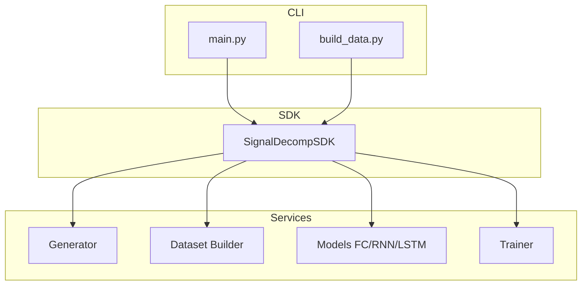

# PLAN — Architecture & System Design

## 1. Overview
The goal is to design a robust system for **Signal Decomposition** using three different neural architectures. The system must be scalable, maintainable, and adhere to professional software standards (SDK Pattern).

## 2. System Architecture (C4 Model)

### Context
*   **User/Researcher:** Interacts with the CLI to build data, train models, and run noise analysis.
*   **Signal Decomposition System:** The core logic that generates synthetic data and manages the neural training lifecycle.

### Container
*   **CLI Layer (`main.py`, `build_data.py`):** User entry points.
*   **SDK Layer (`src/signal_decomp/sdk/`):** The single gateway for all operations.
*   **Service Layer (`src/signal_decomp/services/`):** Specialized modules for data generation, dataset building, model definition, and training loops.

### Component

## 3. Design Patterns & Principles
*   **SDK Pattern:** Centralizes logic into `SignalDecompSDK` to decouple the UI/CLI from the business logic.
*   **Dependency Injection:** Configuration is passed into the SDK at initialization.
*   **Single Responsibility:** Each service handles one specific domain (e.g., `generator.py` only deals with signal math).
*   **Strategy Pattern:** The `Trainer` works with any model that inherits from `nn.Module`.

## 4. Implementation Strategy (Paper-Level)
1.  **Data Synchronization:** Expanded to **50,000 samples** to provide enough statistical variance for deep models to generalize beyond simple overfitting.
2.  **Architecture Depth:** 
    - **FC:** 3 layers with BatchNorm to prevent internal covariate shift during long training runs.
    - **RNN/LSTM:** Multi-layer stacking (2-3 layers) with 0.1 Dropout to extract higher-order temporal features.
3.  **Optimization:** Reduced Learning Rate (0.0005) and increased Epochs (300) to ensure high-fidelity convergence.

## 5. Noise Sensitivity & Visual Validation
We evaluate model robustness by:
1.  **Noise Stress Test:** Fresh noisy samples from 1% to 20% amplitude noise.
2.  **The Test (Visual):** Qualitative assessment of reconstruction alignment vs. clean ground truth on unseen test segments.
3.  **Spectral Fidelity:** Ensuring the model correctly identifies the target frequency component from the composite spectrum.
